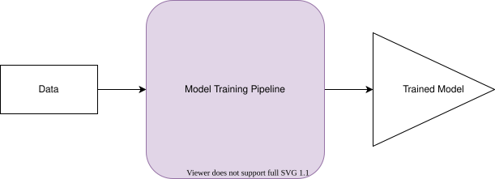
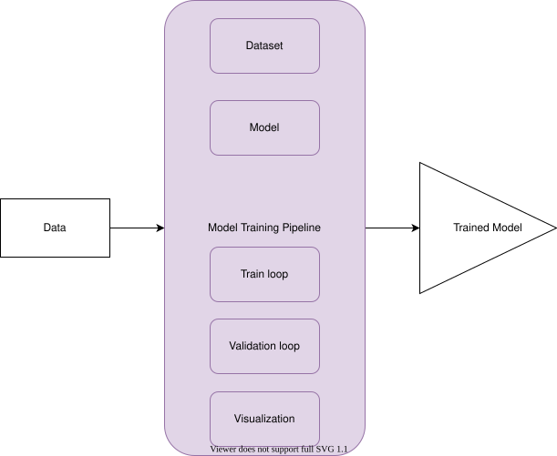
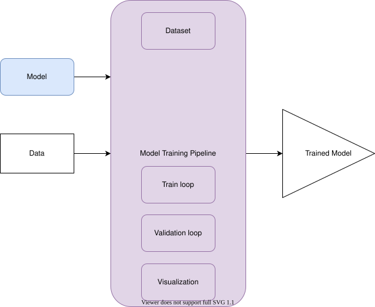
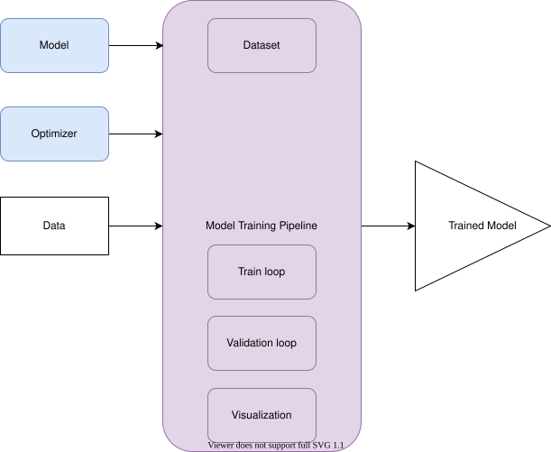
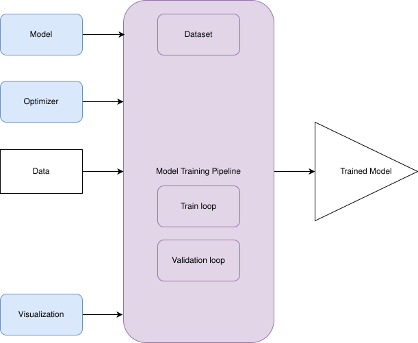
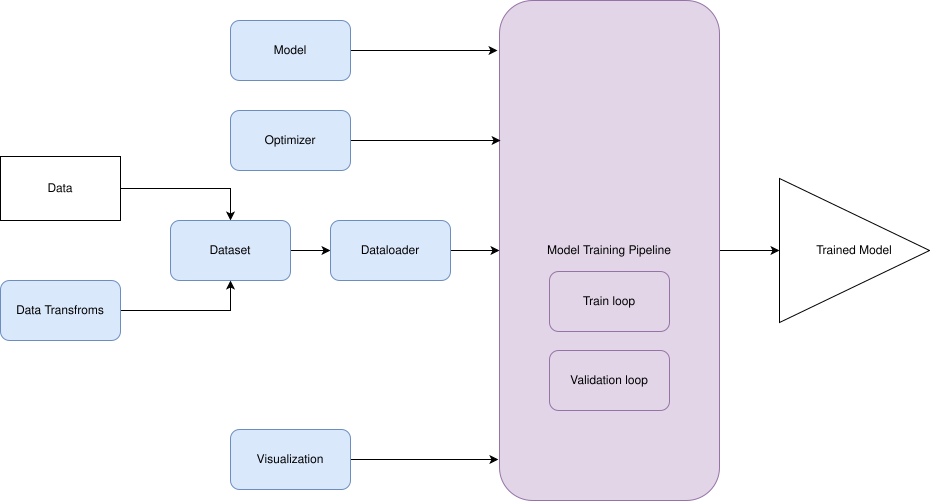
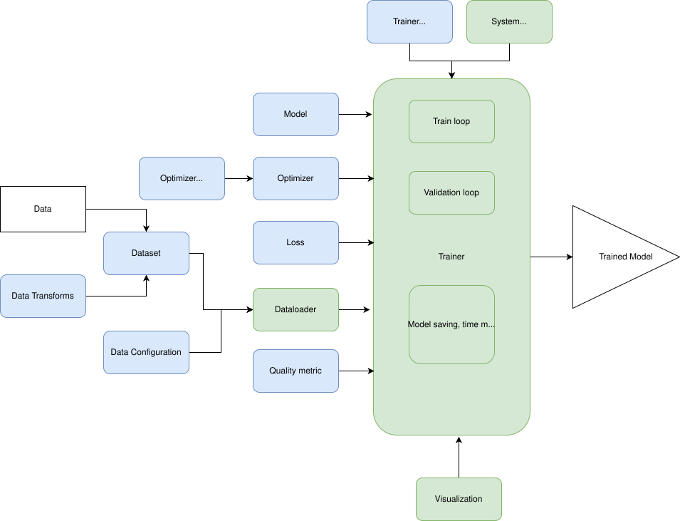

# Modularizing the Training Pipeline ¶

In this Notebook, we will take one more look at the training of the LeNet architecture with the MNIST dataset. But this time, we will not discuss the details of the network or training parameters. Instead, we will work on the training code itself and will try to develop some tools that will save time in the future.

The primary purpose of this notebook is to make you familiar with the idea behind the Trainer helper class. We're going to use this Trainer class for the rest of the course. The training pipeline is similar to what we did for LeNet in the last week, but we will re-organize it in a bit different way.

# Good Practices for Research and Development: A Brief Overview ¶

So now we are already able to build and train simple neural networks. And as you've seen, this training process involves lots of steps. Each of these steps has its parameters. For example, we can define a different batch size for training and validation and for sure, we use different datasets for these phases. On the lower level, we can use different initialization techniques for the different parts of our model and so on.

As you probably know, we consider the research as a good one if and only if its results are reproducible. Indeed, if you claim that something is real (for example, that this specific model is capable of showing this particular results using that dataset), it should be universally true - and thus another researcher should be able to achieve the same results.

The issue here is that with so many parameters involved, it's hard not to miss something important, something that will spoil the results, make them too good (e.g., doing the validation using the training data), or just not reproducible. And sooner or later, not only will the others have issues trying to get the same results, but you will be stuck trying to get the same performance you reported a year ago.

On one hand, the research community met with this kind of issues some time ago and developed some practices that prevent bad research from being published, like peer review, or blind testing of hypothesis. But now, as lots and lots of research involves doing some simulations, or complex results processing, these techniques are not enough.

On the other hand, the software developers' community also had similar issues. Software systems tend to have multiple places that are subject to the same modification. Typically we say that having the same code in several areas of the software system is a bad practice. The reason is the same as we discussed before with the experiments: having so many parts/parameters to handle in case of modification is error-prone - it's just too simple to miss the change here or there and put the whole system into an inconsistent state.

So the developers' community created a set of simple "rules" that being applied, typically lead you to the better design of the system and it seems that these rules are general enough to be used for research projects: after all, they are software projects, too.

There are many and many of these principles, but let us go through a couple that seem to be the most applicable to our research projects:

> From Wikipedia:
>
>
>
> - "Do not repeat yourself (DRY principle) is a principle of software development aimed at reducing repetition of > software patterns replacing it with abstractions"
>   - The DRY principle is stated as "Every piece of knowledge must have a single, unambiguous, authoritative representation within a system"
> - Rule of three ("Three strikes, and you refactor") is a code refactoring rule of thumb to decide when similar pieces of code should be refactored to avoid duplication.
>   - It states that two instances of same code don't require refactoring, but when similar code is used three times, it should be extracted into a new procedure. The rule was popularised by Martin Fowler in Refactoring and attributed to Don Roberts.
> - Single responsibility principle
>   - A class should only have a single responsibility, that is, only changes to one part of the software's specification should be able to affect the specification of the class.

If you want to learn more about these practices and principles, we recommend you to read the excellent "Pragmatic programmer" book - it is short, but it may boost the productivity of your research a lot.
Let's verify our training code against these principles.

# Training Code: Software Development Principles Check ¶

Let's discuss the training code from the software development point of view. Now we have more or less plain code structure - yes, we have several functions, but in general, our pipeline can be represented with the image below:

---



---

It is a "white box" - we put data to it; it does something we've specified and provides the trained model as the output. To change the behavior, we should deal with the code inside the "Model Training Pipeline" box. What we'd like to have, according to the principles I've listed above, is a more flexible system, a system that we can control via parameters, not via changing its code. So let's try to achieve this goal and take a look at what do we have inside the model training pipeline. Can we see any logical blocks there? Maybe some parts of the code are independent of each other (have separate areas of responsibility)?

---



---

Typically, we have the following blocks in the code:

- the model itself (LeNet in our case)
- the dataset
- train loop
- validation loop
- visualization of the results

## Extracting the Model ¶

It seems logical that we can train the same model using different datasets, and we can train different models using the same dataset.
Indeed, we see the case of training different models on the same data each time we read the scientific paper or discuss a new DL architecture - if we're talking about the classification models, it is training on the ImageNet dataset. And regarding training the same model on different datasets - it's just the reason why DL is so popular - we can take an architecture of the model from the paper and apply it to our dataset, right?

So, our scheme now looks a bit different:

---



---

We've extracted the model as a "plug-n-play" block of the training pipeline. And if we take a look at the code, we already have everything for it - we've specified a class for our model, and our `train` function takes the model as a parameter.

```
class LeNet5(nn.Module):
    def __init__(self):
        super().__init__()

        self._body = nn.Sequential(
            nn.Conv2d(in_channels=1, out_channels=6, kernel_size=5),
            nn.ReLU(inplace=True),
            nn.MaxPool2d(kernel_size=2),
            nn.Conv2d(in_channels=6, out_channels=16, kernel_size=5),
            nn.ReLU(inplace=True),
            nn.MaxPool2d(kernel_size=2),
        )
        self._head = nn.Sequential(
            nn.Linear(in_features=16 * 5 * 5, out_features=120),
            nn.ReLU(inplace=True),
            nn.Linear(in_features=120, out_features=84),
            nn.ReLU(inplace=True),
            nn.Linear(in_features=84, out_features=10)
        )

    def forward(self, x):
        x = self._body(x)
        x = x.view(x.size()[0], -1)
        x = self._head(x)
        return x

```

### Develop the Interface for the Train Function ¶

Let's define a template for the training function. We know that it should take our Model:

```
def train(
    model: nn.Module, # out model
    *args # the rest of the arguments
) -> None:
    pass

```

## Extracing the Optimizer ¶

We can also see that the `Optimizer` is agnostic to the dataset and the model it deals with - it should only know the parameters of the models (as a list of tensors), their gradients, and the metric to optimize. What we see in the interface of the optimizer is that it takes the models' parameters and has a set of its own parameters, nothing more. So its configuration can be easily moved out of the training pipeline, and we can pass it as a parameter - and we do, actually!

---



---

### Develop the Interface for the Train Function ¶

So the `train` function should look like this:

```
def train(
    model: nn.Module, # our model
    optimizer: torch.optim.Optimizer, # our optimizer
    *args # the rest of the arguments
) -> None:
    pass

```

## Extracting Visualization ¶

Also, visualization probably does not depend on how do we train the model and the model - it only should know what number to show and what label to associate with this number (like loss value, or quality value, and so on). So as far as we visualize some numerical values, we do not depend on the rest of the code.

---



---

### Develop the Interface for the Train Function ¶

So the interface for the `train` should be updated again.

```
def train(
    model: nn.Module, # our model
    optimizer: torch.optim.Optimizer, # our optimizer
    visualizer, # our visualization tool
    *args # the rest of the arguments
) -> None:
    pass

```

In the previous practice we've introduced the following code for visualization:

```
# Plot loss
plt.rcParams["figure.figsize"] = (10, 6)
x = range(len(epoch_train_loss))

plt.figure
plt.plot(x, epoch_train_loss, color='r', label="train loss")
plt.plot(x, epoch_test_loss, color='b', label="validation loss")
plt.xlabel('epoch no.')
plt.ylabel('loss')
plt.legend(loc='upper right')
plt.title('Training and Validation Loss')
plt.show()

```

It works after the training is finished. But potentially, we can do the visualization in an online manner - after each epoch or even after each batch. More than that, we can use different visualization tools - matplotlib, tensorboard, or even printing the corresponding values to the standard output - we can name it "visualization," too.

Let's try to design an interface for the class that can do the visualization in online mode.

```
class Visualizer:
    def __init__(self):
        self._epochs = []
        self._metrics = defaultdict(list)

    def plot(self):
        for key, value in self._metrics.items():
            self._plot_metric(key, value)

    @abstractmethod
    def _plot_metric(self, metric_name, metric_values):
        # do the visualization
        pass

    def update_metrics(self, name, value, epoch):
        self._metrics[name].append(value)
        self._epochs.append(epoch)

```

**What do we do here?**

We assume that the training/validation loop takes the Visualizer object to send updates on the metric values to it. Which metric is in use is not the area of responsibility of this class - all it should know is that each metric has a name, a value, and an associated epoch index so that we can draw it as a chart. We may omit the epoch index, but it will make things go wrong if we do not start from the epoch 0 (e.g., continue an interrupted training)

## Extracting the Dataset wrapper ¶

The next fruit for our code preparation discussion is the Dataset. As we've decided, we can train the same models using different datasets, so the Dataset class should also be the parameter of the training pipeline. Let's do it.

What's great for us is that Pytorch provides the Dataset and Dataloader abstraction, which are very powerful. Using them, we can not only extract the Dataset as a parameter of the training pipeline but also pre-configure it with the number of workers to load the data, the data transformations to use, and so on. This is what we've done before. We just stress the idea behind these classes - we separate the things that tend to change fast (model, Dataset, visualization) from the things that are typically the same among the DL workloads (training and validation loops).

---



---

```
def get_data(batch_size, data_root='data', num_workers=1):

    train_test_transforms = transforms.Compose([
        # Resize to 32X32
        transforms.Resize((32, 32)),
        # this re-scales image tensor values between 0-1. image_tensor /= 255
        transforms.ToTensor(),
        # subtract mean (0.1307) and divide by variance (0.3081).
        # This mean and variance is calculated on training data (verify yourself)
        transforms.Normalize((0.1307, ), (0.3081, ))
    ])

    # train dataloader
    train_loader = torch.utils.data.DataLoader(
        datasets.MNIST(root=data_root, train=True, download=True, transform=train_test_transforms),
        batch_size=batch_size,
        shuffle=True,
        num_workers=num_workers
    )

    # test dataloader
    test_loader = torch.utils.data.DataLoader(
        datasets.MNIST(root=data_root, train=False, download=True, transform=train_test_transforms),
        batch_size=batch_size,
        shuffle=False,
        num_workers=num_workers
    )
    return train_loader, test_loader

```

### Develop the Interface for the Train Function ¶

Now, as we've moved almost all the modules of the system out of the training pipeline and converted them to the pluggable modules, we can look at the core of the training pipeline - training and validation loops. Let's look at their current implementations. We've already mentioned the `train` function interface, so let's start with this function. In the previous practice, we had the following code:

```
def train(
    device: Any(torch.device, string),
    log_interval: int,
    model: nn.Module,
    optimizer: torch.optim.Optimizer,
    train_loader: torch.utils.data.DataLoader,
    epoch_idx: int,
    visualizer
) -> None:

    # change model in training mode
    model.train()

    # to get batch loss
    batch_loss = np.array([])

    # to get batch accuracy
    batch_acc = np.array([])

    for batch_idx, (data, target) in enumerate(train_loader):

        # clone target
        indx_target = target.clone()
        # send data to device (it is mandatory if GPU has to be used)
        data = data.to(device)
        # send target to device
        target = target.to(device)

        # reset parameters gradient to zero
        optimizer.zero_grad()

        # forward pass to the model
        output = model(data)

        # cross entropy loss
        loss = F.cross_entropy(output, target)

        # find gradients w.r.t training parameters
        loss.backward()
        # Update parameters using gradients
        optimizer.step()

        batch_loss = np.append(batch_loss, [loss.item()])

        # get probability score using softmax
        prob = F.softmax(output, dim=1)

        # get the index of the max probability
        pred = prob.data.max(dim=1)[1]

        # correct prediction
        correct = pred.cpu().eq(indx_target).sum()

        # accuracy
        acc = float(correct) / float(len(data))

        batch_acc = np.append(batch_acc, [acc])

        if batch_idx % log_interval == 0 and batch_idx > 0:
            print(
                'Train Epoch: {} [{}/{}] Loss: {:.6f} Acc: {:.4f}'.format(
                    epoch_idx, batch_idx * len(data), len(train_loader.dataset), loss.item(), acc
                )
            )

    epoch_loss = batch_loss.mean()
    epoch_acc = batch_acc.mean()
    return epoch_loss, epoch_acc

```

## Extracting the Loss Function and Quality Metric ¶

What can we say about this train function? Hm, it seems to be agnostic to the model we pass and to the data. But we are restricted with the task - we can only train classification models using cross-entropy loss and accuracy as a metric of quality. But why should we restrict ourselves with these settings? Let's follow the same procedure as we've done with the model and other modules and make loss and quality metric configurable.

```
def train(
    device: Any(torch.device, string),
    log_interval: int,
    model: nn.Module,
    optimizer: torch.optim.Optimizer,
    train_loader: torch.utils.data.DataLoader,
    loss_function: Callable, # loss function
    quality_estimator, # accuracy or other metric calculator
    visualizer,
    epoch_idx: int
) -> None:

    # change model in training mode
    model.train()

    # to get batch loss we can use the visualizer now
#     batch_loss = np.array([])

    for batch_idx, (data, target) in enumerate(train_loader):

        # clone target
        indx_target = target.clone()
        # send data to device (it is mandatory if GPU has to be used)
        data = data.to(device)
        # send target to device
        target = target.to(device)

        # reset parameters gradient to zero
        optimizer.zero_grad()

        # forward pass to the model
        output = model(data)

        # cross entropy loss
        loss = loss_function(output, target)

        # find gradients w.r.t training parameters
        loss.backward()
        # Update parameters using gradients
        optimizer.step()

#         batch_loss = np.append(batch_loss, [loss.item()])
        # we should do it using the visualizer
        visualizer.update_metrics('batch_loss', loss.item(), batch_idx)

        # get the index of the max probability
        # we can handle it inside the quality estimator
#         pred = output.data.max(dim=1)[1]  

        quality_estimator.update(output, indx_target)

        # visualizer should handle it for us
#         if batch_idx % log_interval == 0 and batch_idx > 0:              
#             print(
#                 'Train Epoch: {} [{}/{}] Loss: {:.6f} Acc: {:.4f}'.format(
#                     epoch_idx, batch_idx * len(data), len(train_loader.dataset), loss.item(), acc
#                 )
#             )

#     epoch_loss = batch_loss.mean()
    # epoch_acc = batch_acc.mean()
    # we can do it outside of the loop now, as quality estimator and visualizer may store the values for us
    return

```

So if we remove all the commented code, we can see that our `train` function is much shorter and is much more readable now. That is great because the less code we put into one function, the less the chance that we will miss an error in the code.

---

```
def train(
    device: Any(torch.device, string),
    log_interval: int,
    model: nn.Module,
    optimizer: torch.optim.Optimizer,
    train_loader: torch.utils.data.DataLoader,
    loss_function: Callable, # loss function
    quality_estimator, # accuracy or other metric calculator
    visualizer
) -> None:

    model.train()

    for batch_idx, (data, target) in enumerate(train_loader):

        # clone target
        indx_target = target.clone()
        # send data to device (it is mandatory if GPU has to be used)
        data = data.to(device)
        # send target to device
        target = target.to(device)

        # reset parameters gradient to zero
        optimizer.zero_grad()

        # forward pass to the model
        output = model(data)

        # cross entropy loss
        loss = loss_function(output, target)

        # find gradients w.r.t training parameters
        loss.backward()
        # Update parameters using gradients
        optimizer.step()

        visualizer.update_metrics('batch_loss', loss.item(), batch_idx)

        quality_estimator.update(output, indx_target)
    return

```

Wow, the train function fits into one screen now! More than that, it is now agnostic to the model we train, to the way we train this model, to the quality metric we use, and so on.

We can do the same procedure for the validation function, but let's omit it for your own practice.

# Configurations ¶

It seems to me now that we have too many parameters for the train function. Maybe we can group them somehow?
Actually, yes - if we take a close look at these parameters, we may notice that there are two distinct groups of the parameters. One is for callable parameters: model, loss function, quality estimator, and so on. And another one is for things like a training device and log interval. We can name the latter group as `TrainingConfiguration` class. We put all these training process-related settings to it - just to have a more transparent interface with fewer parameters. Having the object of such class, we can easily print it to the file. We can place that file somewhere near the results of the training and have these parameters logged for further usage.

We can exploit the same idea of the `<Something>Configuration` classes for the other parts of our training pipeline, like the dataloader.

---

```
@dataclass
class SystemConfiguration:
    '''
    Describes the common system setting needed for reproducible training
    '''
    seed: int = 42  # seed number to set the state of all random number generators
    cudnn_benchmark_enabled: bool = True  # enable CuDNN benchmark for the sake of performance
    cudnn_deterministic: bool = True  # make cudnn deterministic (reproducible training)

@dataclass
class TrainingConfiguration:
    '''
    Describes configuration of the training process
    '''
    batch_size: int = 32  # amount of data to pass through the network at each forward-backward iteration
    epochs_count: int = 20  # number of times the whole dataset will be passed through the network
    learning_rate: float = 0.01  # determines the speed of network's weights update
    log_interval: int = 100  # how many batches to wait between logging training status
    test_interval: int = 1  # how many epochs to wait before another test. Set to 1 to get val loss at each epoch
    data_root: str = "data"  # folder to save MNIST data (default: data/mnist-data)
    num_workers: int = 10  # number of concurrent processes used to prepare data
    device: str = 'cuda'  # device to use for training.

```

# Main Function ¶

**Now let's take a look at our `main` function, where we iterate over the epochs of the model training and gather all the pieces.**

---

HTML generated using hilite.me

```
def main(system_configuration=SystemConfiguration(), training_configuration=TrainingConfiguration()):

    # system configuration
    setup_system(system_configuration)

    # batch size
    batch_size_to_set = training_configuration.batch_size
    # num_workers
    num_workers_to_set = training_configuration.num_workers
    # epochs
    epoch_num_to_set = training_configuration.epochs_count

    # if GPU is available use training config, 
    # else lower batch_size, num_workers and epochs count
    if torch.cuda.is_available():
        device = "cuda"
    else:
        device = "cpu"
        batch_size_to_set = 16
        num_workers_to_set = 2
        epoch_num_to_set = 5

    # data loader
    train_loader, test_loader = get_data(
        batch_size=batch_size_to_set,
        data_root=training_configuration.data_root,
        num_workers=num_workers_to_set
    )

    # Update training configuration
    training_configuration = TrainingConfiguration(
        device=device,
        epochs_count=epoch_num_to_set,
        batch_size=batch_size_to_set,
        num_workers=num_workers_to_set
    )

    # initiate model
    model = LeNet5()

    # send model to device (GPU/CPU)
    model.to(training_configuration.device)

    # optimizer
    optimizer = optim.SGD(
        model.parameters(),
        lr=training_configuration.learning_rate
    )

    best_loss = torch.tensor(np.inf)

    # epoch train/test loss
    epoch_train_loss = np.array([])
    epoch_test_loss = np.array([])

    # epoch train/test accuracy
    epoch_train_acc = np.array([])
    epoch_test_acc = np.array([])

    # training time measurement
    t_begin = time.time()
    for epoch in range(training_configuration.epochs_count):

        train_loss, train_acc = train(training_configuration, model, optimizer, train_loader, epoch)

        epoch_train_loss = np.append(epoch_train_loss, [train_loss])

        epoch_train_acc = np.append(epoch_train_acc, [train_acc])

        elapsed_time = time.time() - t_begin
        speed_epoch = elapsed_time / (epoch + 1)
        speed_batch = speed_epoch / len(train_loader)
        eta = speed_epoch * training_configuration.epochs_count - elapsed_time

        print(
            "Elapsed {:.2f}s, {:.2f} s/epoch, {:.2f} s/batch, ets {:.2f}s".format(
                elapsed_time, speed_epoch, speed_batch, eta
            )
        )

        if epoch % training_configuration.test_interval == 0:
            current_loss, current_accuracy = validate(training_configuration, model, test_loader)

            epoch_test_loss = np.append(epoch_test_loss, [current_loss])

            epoch_test_acc = np.append(epoch_test_acc, [current_accuracy])

            if current_loss < best_loss:
                best_loss = current_loss

    print("Total time: {:.2f}, Best Loss: {:.3f}".format(time.time() - t_begin, best_loss))

    return model, epoch_train_loss, epoch_train_acc, epoch_test_loss, epoch_test_acc

```

### Develop the Interface for the Main Function ¶

**Let me collapse the logical blocks of this function and provide the following structure:**

---

```
def main(system_configuration=SystemConfiguration(), training_configuration=TrainingConfiguration()):
    # prepare the model
    # prepare the data
    # prepare the loss
    # prepare the optimizer
    # prepare the visualization

    # initialize some internal stuff

    for epoch in range(training_configuration.epochs_count):

        # train one epoch with train()

        # do visualization

        if epoch % training_configuration.test_interval == 0:
            # validate

            # do some internal stuff on the best model selection
            pass

```

The structure

```
    # initialize some internal stuff

    for epoch in range(training_configuration.epochs_count):

        # train one epoch with train()

        # do visualization

        if epoch % training_configuration.test_interval == 0:
            # validate

            # do some internal stuff on the best model selection
```

seems to be agnostic to the rest of the things we deal with - so we can generalize it the same way as we did for the `train` function. We rename the `train` to `train_epoch` and this new function will be just `train`.

But now we have generalized `train` and generalized `train_epoch`, and also we have some internal things around these functions that are needed for the training time printing and models saving and so on. So it worth it to extract this stuff to a class and name it `Trainer`.

# Experiment Pipeline: The Training Process ¶

**Let's take a look at the modules diagram in the training pipeline again:**

---



---

Obviously, there are many different ways of decomposing the system into the independent blocks and this scheme only shows one of them (that we found to work well in practice and be aligned well with Pytorch philosophy)

Blocks in green are the blocks that typically do not change with the change of your business/research task. They are mostly engineering-related parts of your deep learning pipeline. Typically you invest some time into their development or use some open-source blocks for them - they help you to obtain reliable and reproducible results, do not fail because your best model was overwritten with another one, and so on.

Blocks in blue are the blocks that require your attention as a researcher - they are task-specific, and it is presumed that the most time you'll spend changing these blocks and trying different hypotheses.

The separation of the deep learning pipeline helps a lot to speed up the research and get reliable results.

Since the "engineering" part of the pipeline is assumed to change much less often, compared to the "research" part, it makes sense to extract the code of these classes and functions to a separate library. The idea is that you can share this library among your research group and benefit from the improvements your colleagues made. Also, it makes your research code more clean and concise - you do not go through the system setup and files saving code anymore while you're taking a top-level overview of your project.

So, in this course, we've developed a small version of such an "engineering" part of the training pipeline. You will find it in the "trainer" folder in the following lectures. We will put the "research" part in each practice into the notebook. We will work with the trainer as we do in non-study projects: configure it to train our models properly using the correct data. We will not pay attention to the trainer code unless it is necessary.

# References ¶

You may wonder whether it is a common way of doing deep learning or we're overengineering here. We may assure you that this is a common way to do deep learning research in an industry - most of the companies and research groups invest in building these DL training frameworks for their projects, and some of them are even published to the open-source. To name a couple of them:

- https://github.com/NVlabs/SPADE
- https://github.com/pytorch/ignite
- https://github.com/PyTorchLightning/pytorch-lightning
- https://github.com/catalyst-team/catalyst
- https://github.com/open-mmlab/mmdetection
- https://github.com/fastai/fastai
